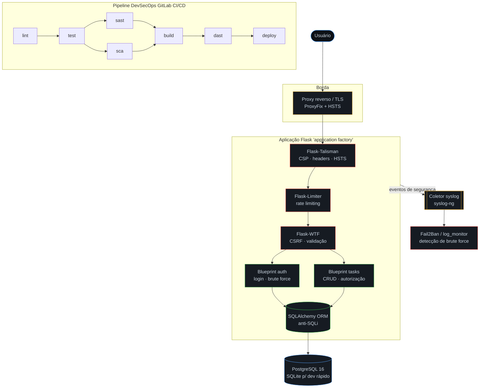
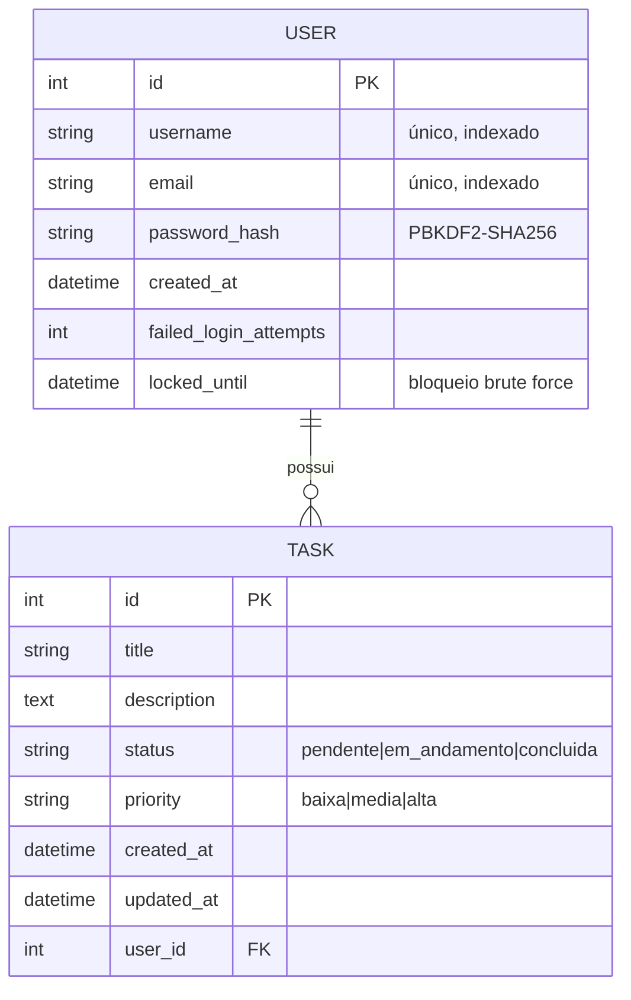
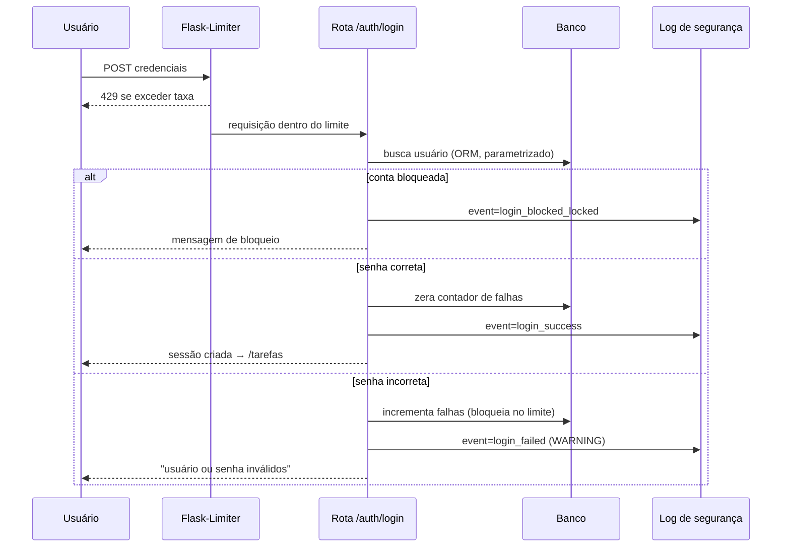
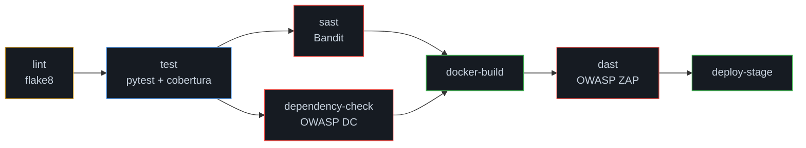

<div align="center">

# ⛨ TaskGuard

### Gerenciador Seguro de Tarefas Pessoais — um *case* completo de DevSecOps

*Autenticação robusta · CRUD de tarefas · Logs via syslog · Docker · Pipeline CI/CD · SAST · SCA · DAST · Monitoramento*

<br>


</div>

---

## 📑 Sumário

1. [Descrição](#-descrição)
2. [Objetivos](#-objetivos)
3. [Arquitetura](#-arquitetura)
4. [Tecnologias](#-tecnologias-utilizadas)
5. [Estrutura de diretórios](#-estrutura-de-diretórios)
6. [Requisitos funcionais](#-requisitos-funcionais)
7. [Requisitos não funcionais](#-requisitos-não-funcionais)
8. [Modelagem da solução](#-modelagem-da-solução)
9. [Ameaças e mitigações](#-ameaças-de-segurança-e-mitigações)
10. [Pipeline CI/CD](#-pipeline-cicd)
11. [SAST](#-sast--análise-estática) · [SCA](#-sca--análise-de-dependências) · [DAST](#-dast--análise-dinâmica)
12. [Monitoramento e observabilidade](#-monitoramento-e-observabilidade)
13. [Logs](#-logs)
14. [Screenshots](#-screenshots)
15. [Execução local](#-execução-local)
16. [Execução com Docker](#-execução-com-docker)
17. [Instruções de CI/CD](#-instruções-de-cicd)
18. [Práticas de segurança](#-práticas-de-segurança)
19. [Roadmap](#-roadmap) · [Melhorias futuras](#-melhorias-futuras)
20. [Conclusão](#-conclusão) · [Autor](#-autor)

---

## 📋 Descrição

**TaskGuard** é uma aplicação web para gerenciamento de tarefas pessoais construída com **Python + Flask**, mas seu verdadeiro propósito é servir de **estudo de caso de DevSecOps de ponta a ponta**: cada decisão de arquitetura, código e infraestrutura foi tomada com segurança como requisito de primeira classe — *shift-left security*.

A aplicação exige autenticação, oferece um CRUD completo de tarefas com busca e filtros, registra eventos sensíveis em um canal de log dedicado (com encaminhamento opcional para **syslog**), roda em **containers Docker** endurecidos e é validada por uma **pipeline CI/CD** que integra análise estática (**Bandit**), análise de dependências (**OWASP Dependency-Check**) e análise dinâmica (**OWASP ZAP**), além de testes automatizados com cobertura mínima exigida.

---

## 🎯 Objetivos

- **Demonstrar segurança aplicada**: implementar, na prática, defesas contra as principais classes do **OWASP Top 10** (injeção, quebra de controle de acesso, XSS, CSRF, identificação/autenticação falhas, etc.).
- **Automatizar a verificação de segurança**: garantir que nenhuma vulnerabilidade de severidade alta chegue ao *deploy*, fazendo a pipeline falhar automaticamente.
- **Operar com observabilidade**: produzir logs estruturados e auditáveis, com detecção de força bruta.
- **Entregar um artefato de portfólio**: código limpo, organizado, documentado e pronto para Git (GitLab/GitHub), no padrão *enterprise*.

---

## 🏗 Arquitetura



**Padrões adotados:** *application factory* (testabilidade e múltiplos ambientes), *blueprints* (modularização por domínio), *defesa em profundidade* (várias camadas de proteção independentes) e *12-factor app* (configuração via ambiente, logs em stdout).

---

## 🧰 Tecnologias utilizadas

| Camada | Tecnologias |
|---|---|
| **Backend** | Python 3.12, Flask 3, Gunicorn |
| **Persistência** | SQLAlchemy 2 (ORM), PostgreSQL 16 (Docker/prod) · SQLite (dev rápido) |
| **Frontend** | HTML5, CSS3 (tema próprio), JavaScript *vanilla* (sob CSP estrita) |
| **Autenticação** | Flask-Login, Werkzeug (hash PBKDF2-SHA256) |
| **Segurança** | Flask-Talisman, Flask-Limiter, Flask-WTF (CSRF) |
| **Containers** | Docker (multi-stage), Docker Compose |
| **CI/CD** | GitLab CI/CD |
| **SAST** | Bandit |
| **SCA** | OWASP Dependency-Check |
| **DAST** | OWASP ZAP (Baseline Scan) |
| **Logs/Monitoramento** | syslog-ng, Fail2Ban, monitor próprio em Python |
| **Testes/Qualidade** | pytest, pytest-cov, flake8 |

---

## 📂 Estrutura de diretórios

```
taskguard/
├── app/                          # Pacote da aplicação (application factory)
│   ├── __init__.py               # create_app(): monta e configura o app
│   ├── extensions.py             # Instâncias das extensões Flask
│   ├── models.py                 # Modelos User e Task (ORM)
│   ├── security.py               # Talisman, headers e sanitização
│   ├── logging_config.py         # Logging multi-destino + syslog
│   ├── errors.py                 # Tratadores de erro (400/403/404/429/500)
│   ├── auth/                     # Blueprint de autenticação
│   │   ├── forms.py              # LoginForm, RegisterForm (validação)
│   │   └── routes.py             # login, logout, register + brute force
│   ├── tasks/                    # Blueprint do CRUD de tarefas
│   │   ├── forms.py              # TaskForm, SearchForm
│   │   └── routes.py             # CRUD + busca + autorização
│   └── main/
│       └── routes.py             # index e /health
├── templates/                    # Jinja2 (auto-escape) + páginas de erro
├── static/                       # CSS e JS próprios
├── tests/                        # Suíte pytest (auth, tasks, security)
├── logs/                         # Logs em runtime (versionado vazio)
├── docker/
│   └── syslog/syslog-ng.conf     # Config do coletor de logs
├── monitoring/
│   ├── fail2ban/                 # jail.local + filtro de brute force
│   └── log_monitor.py            # Detector de brute force multiplataforma
├── scripts/
│   ├── init_db.py                # Cria tabelas / dados demo
│   ├── run_sast.sh               # SAST (Bandit)
│   ├── run_dependency_check.sh   # SCA (Dependency-Check)
│   └── run_dast.sh               # DAST (OWASP ZAP)
├── pipeline/
│   ├── zap/rules.tsv             # Política de alertas do ZAP
│   └── dependency-check/suppression.xml
├── .gitlab-ci.yml                # Pipeline CI/CD (GitLab, 6 stages)
├── docs/relatorio_academico.pdf  # Relatório acadêmico (4 páginas)
├── Dockerfile                    # Imagem multi-stage, usuário não-root
├── docker-compose.yml            # db (Postgres) + web + syslog + perfil DAST
├── requirements.txt              # Dependências de produção (pinadas)
├── requirements-dev.txt          # Dependências de dev/teste/SAST
├── config.py                     # Configuração por ambiente
├── run.py                        # Ponto de entrada (WSGI)
├── pyproject.toml · pytest.ini · .flake8
├── .env.example · .gitignore · .dockerignore
└── README.md
```

---

## ✅ Requisitos funcionais

| ID | Requisito |
|----|-----------|
| RF01 | O usuário deve poder **criar uma conta** com usuário, e-mail e senha forte. |
| RF02 | O sistema deve exigir **login** para acessar qualquer funcionalidade. |
| RF03 | O usuário deve poder **encerrar a sessão** (logout). |
| RF04 | O usuário deve poder **criar, listar, editar e excluir** tarefas. |
| RF05 | O usuário deve poder **pesquisar** tarefas por título/descrição e **filtrar** por status. |
| RF06 | O usuário deve poder **marcar/desmarcar** uma tarefa como concluída. |
| RF07 | Um usuário **não pode** visualizar ou alterar tarefas de outro usuário. |
| RF08 | O sistema deve **registrar** eventos de autenticação e de segurança. |
| RF09 | O sistema deve **bloquear temporariamente** contas após excesso de falhas. |
| RF10 | O sistema deve expor um endpoint de **health check** para orquestração. |

## ⚙ Requisitos não funcionais

| ID | Requisito |
|----|-----------|
| RNF01 | **Segurança**: defesas contra OWASP Top 10 (injeção, XSS, CSRF, *broken access control*). |
| RNF02 | **Confidencialidade**: senhas armazenadas apenas como *hash* (PBKDF2-SHA256). |
| RNF03 | **Portabilidade**: execução idêntica via Docker em qualquer host. |
| RNF04 | **Manutenibilidade**: código modular, comentado, com Clean Code. |
| RNF05 | **Testabilidade**: cobertura mínima de **80%** garantida pela pipeline. |
| RNF06 | **Observabilidade**: logs estruturados em múltiplos destinos + syslog. |
| RNF07 | **Disponibilidade**: *healthcheck* e *restart* automático no Compose. |
| RNF08 | **Conformidade do build**: nenhuma vulnerabilidade ALTA chega ao deploy. |
| RNF09 | **Acessibilidade**: foco visível por teclado e suporte a *reduced motion*. |

---

## 🧩 Modelagem da solução

**Entidades e relacionamento (1:N)** — um usuário possui muitas tarefas; a exclusão de um usuário remove suas tarefas em cascata.



**Fluxo de autenticação (com proteção brute force):**



---

## 🛡 Ameaças de segurança e mitigações

Modelagem baseada em **STRIDE** e no **OWASP Top 10**:

| # | Ameaça | Categoria | Mitigação implementada |
|---|--------|-----------|------------------------|
| 1 | **SQL Injection** | Tampering | Acesso exclusivo via **SQLAlchemy ORM** (consultas parametrizadas); zero SQL concatenado. |
| 2 | **Cross-Site Scripting (XSS)** | Tampering | Auto-escape do Jinja2 + **sanitização** dupla (`sanitize_text`) + **CSP** estrita com *nonce*. |
| 3 | **Cross-Site Request Forgery (CSRF)** | Spoofing | **Flask-WTF** com token CSRF em todos os formulários; ações destrutivas só via POST. |
| 4 | **Quebra de autenticação / Brute force** | Spoofing | **Rate limiting** (Flask-Limiter) + **bloqueio de conta** temporário + política de senha forte. |
| 5 | **Broken Access Control (IDOR)** | Elevation of Privilege | Toda tarefa é validada quanto ao **proprietário**; acesso indevido retorna 404 e gera log. |
| 6 | **Sequestro de sessão** | Spoofing | Cookies `HttpOnly`, `Secure`, `SameSite=Lax`; `session_protection="strong"`. |
| 7 | **Exposição de credenciais** | Information Disclosure | Senhas apenas como **hash PBKDF2**; segredos em `.env`/cofre, nunca em código. |
| 8 | **Clickjacking** | Tampering | `X-Frame-Options: DENY` + `frame-ancestors 'none'`. |
| 9 | **Man-in-the-middle** | Information Disclosure | **HSTS** e redirecionamento HTTPS via Talisman (produção). |
| 10 | **Repúdio / falta de trilha** | Repudiation | **Log de segurança dedicado** com IP, usuário e evento, encaminhável a SIEM. |
| 11 | **Dependências vulneráveis** | — (A06 OWASP) | **OWASP Dependency-Check** na pipeline, falha em CVSS ≥ 7. |
| 12 | **Negação de serviço (abuso)** | Denial of Service | Rate limiting global + por rota; *workers* Gunicorn dimensionáveis. |

---

## 🚀 Pipeline CI/CD

Definida em [`.gitlab-ci.yml`](.gitlab-ci.yml), a pipeline encadeia sete *jobs* em seis *stages* do GitLab. Os jobs de segurança (**sast** e **dependency-check**) rodam em paralelo no mesmo *stage*, após os testes, para acelerar o *feedback*.



| Estágio | Ferramenta | O que faz | Quando falha |
|---------|-----------|-----------|--------------|
| **lint** | flake8 | Padronização e *code smells* | erro de estilo/complexidade |
| **test** | pytest + coverage | Testes unitários/integração/funcionais | teste quebrado ou cobertura < 80% |
| **sast** | Bandit | Análise estática de segurança do código | vulnerabilidade severidade ALTA |
| **dependency-check** | OWASP Dependency-Check | CVEs em dependências | CVSS ≥ 7 |
| **docker-build** | Docker-in-Docker | Build da imagem multi-stage | falha de build |
| **dast** | OWASP ZAP | Varredura dinâmica da app no ar | alerta marcado como FAIL |
| **deploy-stage** | — | Promoção para *staging* (apenas `main`) | — |

Os relatórios de Bandit e Dependency-Check são gerados em **SARIF** e mapeados para `reports:sast` / `reports:dependency_scanning` — ingeridos pelo *Security Dashboard* do **GitLab Ultimate** — além de ficarem disponíveis como *artifacts* para download em qualquer *tier*.

---

### 🔎 SAST — Análise estática

O **Bandit** percorre a árvore de código procurando padrões inseguros (uso de `eval`, `subprocess` com `shell=True`, *hardcoded secrets*, deserialização insegura, geração fraca de aleatoriedade, etc.). O *gate* da pipeline (`scripts/run_sast.sh`) executa `bandit -lll -iii`, que **falha em qualquer issue de severidade alta com alta confiança**.

```bash
./scripts/run_sast.sh        # relatório em reports/bandit-report.json + gate
```

### 📦 SCA — Análise de dependências

O **OWASP Dependency-Check** cruza as bibliotecas declaradas em `requirements*.txt` com a base **NVD/CVE**, gerando relatório navegável e quebrando a pipeline quando há CVE com **CVSS ≥ 7**. Falsos-positivos são tratados de forma auditável em `pipeline/dependency-check/suppression.xml`.

```bash
NVD_API_KEY=xxxxx ./scripts/run_dependency_check.sh   # HTML/JSON/SARIF em reports/
```

### 🕷 DAST — Análise dinâmica

O **OWASP ZAP** (modo *Baseline*) ataca a aplicação **em execução**, validando na prática a presença de cabeçalhos de segurança, ausência de XSS/SQLi expostos e proteção CSRF. A política de alertas fica em `pipeline/zap/rules.tsv` (classes críticas como `FAIL`, ruído informativo como `IGNORE`).

```bash
./scripts/run_dast.sh        # sobe a app, escaneia e gera reports/zap-report.html
```

---

## 📡 Monitoramento e observabilidade

- **Detecção de força bruta** com duas opções:
  - **Fail2Ban** (host Linux) — filtro e *jail* prontos em `monitoring/fail2ban/`, banindo IPs que disparam falhas repetidas.
  - **`log_monitor.py`** — alternativa multiplataforma que faz *tail* do `security.log`, agrega falhas por IP em janelas de tempo e emite alertas (útil em containers/Windows).
- **Health check** (`/health`) consumido pelo Docker e pela pipeline (testa conectividade com o banco).
- **Logs em stdout** (12-factor) facilitam coleta por Docker, Loki, ELK, CloudWatch, etc.
- **Encaminhamento a SIEM** via syslog (coletor `syslog-ng` no Compose), pronto para integração central.

```bash
python monitoring/log_monitor.py --threshold 5 --window 60
```

## 🪵 Logs

O subsistema (`app/logging_config.py`) grava em **quatro destinos**:

| Destino | Conteúdo |
|---------|----------|
| **Console (stdout)** | Tudo — ideal para containers |
| `logs/taskguard.log` | Log geral da aplicação (rotativo) |
| `logs/security.log` | **Eventos de segurança** num canal dedicado (rotativo) |
| **syslog** *(opcional)* | Encaminhamento dos eventos de segurança ao coletor central |

Eventos registrados incluem: `user_registered`, `login_success`, `login_failed`, `account_locked`, `logout`, `task_created/updated/deleted`, `idor_attempt`, `rate_limit_exceeded`, `unauthorized_access`. O formato é estável e legível por máquina:

```
2026-06-09 22:45:01 TASKGUARD-SECURITY WARNING event=login_failed ip=203.0.113.7 user=alice detail=Falha de autenticação
```

---

## 🖼 Screenshots

> *Placeholders — substitua pelas capturas reais ao publicar no portfólio.*

| Tela | Imagem |
|------|--------|
| Tela de login | `` |
| Painel de tarefas | `` |
| Formulário de tarefa | `` |
| Relatório do OWASP ZAP | `` |
| Pipeline / Vulnerability report | `` |

---

## 💻 Execução local

> Pré-requisitos: **Python 3.12+** e `git`.

```bash
# 1. Clonar e entrar no projeto
git clone https://gitlab.com/<seu-usuario>/taskguard.git
cd taskguard

# 2. Ambiente virtual
python -m venv .venv
source .venv/bin/activate        # Windows: .venv\Scripts\activate

# 3. Dependências (dev inclui testes e SAST)
pip install -r requirements-dev.txt

# 4. Variáveis de ambiente
cp .env.example .env
# edite o .env e defina um SECRET_KEY forte:
python -c "import secrets; print(secrets.token_hex(32))"

# 5. Banco + dados de demonstração (opcional)
python scripts/init_db.py --seed   # cria usuário demo / Demo@1234

# 6. Subir a aplicação
python run.py
# acesse http://127.0.0.1:5000

# 7. Rodar os testes
pytest
```

## 🐳 Execução com Docker

> Pré-requisitos: **Docker** e **Docker Compose**.

```bash
cp .env.example .env              # defina um SECRET_KEY forte

# Subir banco (PostgreSQL) + aplicação + coletor de logs
# (as tabelas são criadas automaticamente no boot da app)
docker compose up -d --build
# acesse http://localhost:8000   ·   health: http://localhost:8000/health

# (opcional) popular dados de demonstração: demo / Demo@1234
docker compose exec web python scripts/init_db.py --seed

# Ver logs em tempo real
docker compose logs -f web

# Executar o DAST (OWASP ZAP) sob demanda
docker compose --profile security run --rm zap

# Encerrar
docker compose down
```

A imagem é **multi-stage**, roda como **usuário não-root**, descarta *capabilities* (`cap_drop: ALL`), usa `no-new-privileges` e possui **HEALTHCHECK** nativo.

## 🔧 Instruções de CI/CD

1. Faça *push* do projeto para um repositório no **GitLab**.
2. A pipeline em `.gitlab-ci.yml` dispara automaticamente em *push* para `main`/`develop` e em *merge requests* (ver `workflow:rules`).
3. *(Opcional, recomendado)* cadastre a variável **`NVD_API_KEY`** em *Settings → CI/CD → Variables* (marque como *Masked*) para acelerar o Dependency-Check.
4. Acompanhe a execução em **Build → Pipelines**; os achados de segurança aparecem em **Secure → Vulnerability report** (GitLab Ultimate) e como *artifacts* em cada job.

> ⚠️ Os *stages* **docker-build** e **dast** usam **Docker-in-Docker** e exigem um *runner* com executor Docker em modo *privileged* — os *runners* compartilhados do GitLab.com já atendem a esse requisito.
5. O estágio `deploy-stage` roda apenas na branch `main` e está pronto para receber sua lógica real de implantação.

## 🔐 Práticas de segurança

- ✅ Senhas com **hash PBKDF2-SHA256** + *salt* (nunca em texto puro).
- ✅ **CSRF** em todos os formulários; ações destrutivas exclusivamente via POST.
- ✅ **CSP** estrita com *nonce*, `HttpOnly`/`Secure`/`SameSite`, **HSTS**, `X-Frame-Options`, `X-Content-Type-Options`, `Referrer-Policy`, `Permissions-Policy`.
- ✅ **Rate limiting** global e por rota; **bloqueio de conta** por brute force.
- ✅ **Sanitização** de toda entrada do usuário e validação no servidor.
- ✅ **Autorização por proprietário** em cada operação de tarefa (anti-IDOR).
- ✅ **Segredos fora do código** (`.env`/cofre); `.gitignore` cobre `.env`, logs e relatórios.
- ✅ Segurança **verificada automaticamente** a cada commit (SAST + SCA + DAST).

---

## 🗺 Roadmap

- [x] Autenticação com proteção contra brute force
- [x] CRUD de tarefas com busca, filtros e autorização
- [x] Logs multi-destino + syslog
- [x] Docker multi-stage + Compose endurecido
- [x] Pipeline CI/CD com SAST, SCA e DAST
- [x] Monitoramento (Fail2Ban + monitor próprio)
- [x] Suíte de testes com cobertura ≥ 80%
- [ ] Migrações de banco com Alembic
- [ ] API REST documentada (OpenAPI/Swagger)
- [ ] Autenticação multifator (TOTP)

## 🔮 Melhorias futuras

- **MFA/2FA** (TOTP) e *login* social (OAuth2/OIDC).
- **Métricas** Prometheus + dashboards Grafana.
- **Secrets manager** (HashiCorp Vault / AWS Secrets Manager).
- **Assinatura e SBOM** da imagem (cosign + Syft) e *scan* de imagem (Trivy).
- **Deploy** real em Kubernetes com *Network Policies* e *Pod Security Standards*.
- **Internacionalização** (i18n) e modo claro/escuro.

---

## ✍ Conclusão

O **TaskGuard** mostra que segurança não é uma etapa final, e sim um fio condutor presente desde a primeira linha de código até o *deploy*. Ao combinar um backend Flask bem estruturado com defesas concretas contra o OWASP Top 10, *containerização* endurecida, observabilidade e uma pipeline que **bloqueia automaticamente** código e dependências inseguras, o projeto materializa os princípios de **DevSecOps** num artefato real, funcional e reproduzível — adequado tanto para avaliação acadêmica quanto para portfólio profissional.

## 👤 Autor

Projeto desenvolvido como estudo de caso de **Engenharia DevSecOps**.

- **GILSON INÁCIO DA SILVA** · [GitLab](https://gitlab.com/gilson.engsoft-group/taskguard) · [LinkedIn](https://www.linkedin.com/in/gilsoninsilva/)

<div align="center">

---

*Construído com foco em segurança · Flask · Docker · PostgreSQL · OWASP · GitLab CI*

⛨ **TaskGuard** — *Secure by design.*

</div>
